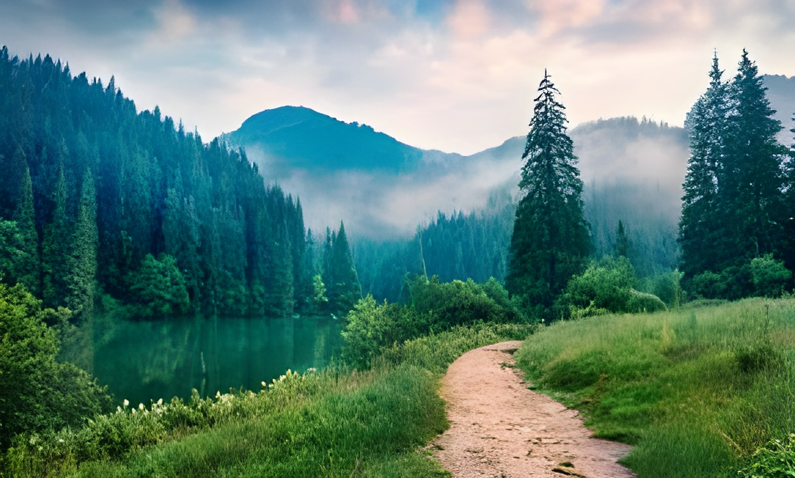

# Image Enhacer

Enhance image quality using **RealESRGAN** with support for batch, single image, and interactive processing.

## Side-by-Side Comparison

<table>
  <tr>
    <th>Input</th>
    <th>Output</th>
  </tr>
  <tr>
    <td>
      
    </td>
    <td>
      
    </td>
  </tr>
  <tr>
    <td>
      
    </td>
    <td>
      
    </td>
  </tr>
</table>

## Clone The Repository
```bash
  git clone https://github.com/1YaswantH1/Image-Enhancer.git

```

## Steps To Run It Locally

```bash
pip install basicsr
pip install facexlib
pip install gfpgan
pip install -r requirements.txt
python setup.py develop
```


## To Run Batch/Single:
```bash
  python inference_realesrgan.py -n RealESRGAN_x4plus -i inputs[Folder/File] -o results --fp32
```

## To Run Interactively
```bash
  python Dynamic_Run.py
```

